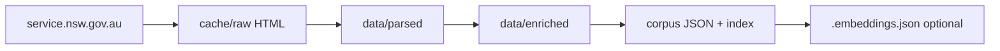

# Pipeline data: what lives where

This is the flow from the live site to the chatbot. Each stage writes **one folder**; nothing is hidden in a database.

| Location | Produced by | What it contains |
|----------|-------------|------------------|
| **`data/`** (`urls.jsonl`) | `discover` | Frontier: every URL SHA1, category, slug, sitemap hints. Rows are **facts about URLs**, not page bodies. |
| **`cache/raw/`** + **`cache/meta/`** | `fetch` | Raw HTML and tiny sidecar meta (HTTP status, final URL after redirects). Filename = SHA1 of canonical URL — **content-addressed** so re-fetch/update is deterministic. |
| **`data/parsed/`** | `parse` | **Deterministic extraction** from HTML only: headings, lists, tables of contents, FAQs, eligibility bullets, fees text, outgoing links — no LLM. One `{sha1}.json` per URL. Missing fields simply absent. Large `extra` / bucket fields hold anything that did not fit the known section names. |
| **`data/enriched/`** | `enrich` | **Small LLM overlay**: same `{sha1}.json`. Adds normalised summary, topics, FAQ polish, canonical bullet lists derived from parsed content. If enrichment fails → error record; **`emit`** still uses parsed fields for that URL. Never invents eligibility or links beyond what came from parsing. |
| **`corpus/`** | `emit` | **Publication shape**: one **`{slug}.json` per logical page**, plus **`index.json`**. Each file merges parsed + enriched (when ok) into the final schema the chat reads (`title`, `summary`, `how_to_steps`, `faqs`, …). Duplicate SHA1-backed rows from earlier stages disappear — the corpus speaks in **paths** (`guide/foo.json`, `transaction/bar.json`) aligned to the site. |
| **`corpus/.embeddings.json`** or **`chatbot/corpus/.embeddings.json`** | `npm run build-index` | **Optional**: one float vector per index row; model name + dimension stored in the file header. Used only for **dense cosine** in retrieval. Not required for BM25. Must match runtime **`EMBED_MODEL`** (same API + model = same vector space). |

### Quick mental model

- **Parsed** = “what the HTML literally says,” structured.
- **Enriched** = “same facts, tidier labels and chat-friendly phrasing,” still grounded in parsed text.
- **Corpus** = “ship it” JSON the RAG layer loads; this is what you version and (for the app) copy under `chatbot/corpus/`.
- **Embeddings** = precomputed search index for semantic similarity; still no vector DB — it is a single JSON file loaded in memory.

### Chatbot copy

`chatbot/corpus/` should mirror `corpus/` (same `index.json` and per-doc JSON files) so Vercel bundles the app and data together. The embedding file is optional but required for **hybrid** (BM25 + dense) in production.
